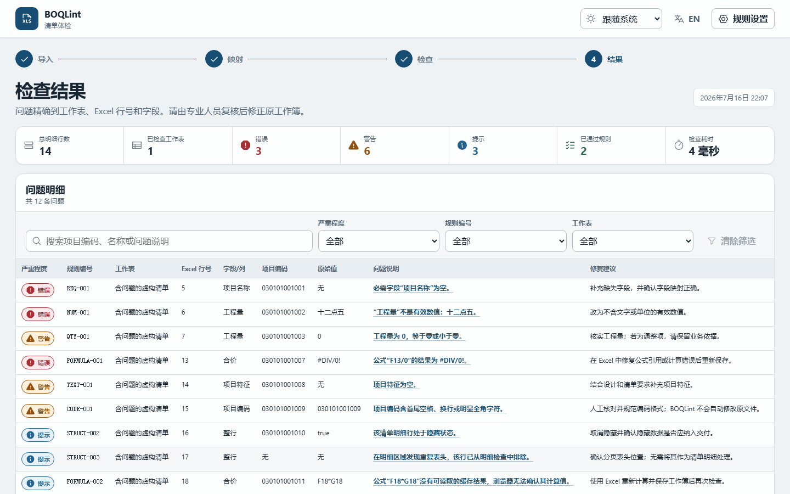

# BOQLint / 清单体检

[简体中文](README.md)

BOQLint is a local-first, browser-based pre-delivery checker for Bill of Quantities Excel workbooks. It helps quantity surveyors and project teams locate missing fields, invalid numbers, duplicates, unit conflicts, amount mismatches, and formula errors.

[Live demo](https://kanadek.github.io/boq-lint/) · [GitHub Release](https://github.com/KanadeK/boq-lint/releases/tag/v0.1.0) · [Rule reference](docs/rules.md) · [Privacy](docs/privacy.md) · [Contributing](CONTRIBUTING.md)



> Your workbook is processed only in your browser and is never uploaded. BOQLint never modifies the source workbook; it creates separate reports.

## Where it fits

```text
Prepare or price a Bill of Quantities
                 ↓
             Export .xlsx
                 ↓
       Run BOQLint locally
                 ↓
Correct field, duplicate, amount, or formula issues
                 ↓
Import into costing software, submit for review, or deliver
```

BOQLint is a data-quality aid before delivery. It is not costing software, a final-account audit tool, a price database, or an item-code generator.

## Use it in three steps

1. **Choose a mode and import**: select an unpriced or priced BOQ, then drop an `.xlsx` file or load a built-in clean/issue sample.
2. **Confirm detection and mapping**: choose worksheets, review the detected header row and field mapping, and adjust them for your template when needed.
3. **Check, locate, and export**: run the rules, filter by severity, rule, worksheet, or text, inspect source-row context, and export XLSX, CSV, or JSON reports.

The interface presents the full flow as Import → Map → Check → Results.

## Check modes

| Mode         | Required fields                                               | Amount check                                       |
| ------------ | ------------------------------------------------------------- | -------------------------------------------------- |
| Unpriced BOQ | Item code, item name, unit, quantity                          | Unit price and total price are optional            |
| Priced BOQ   | Item code, item name, unit, quantity, unit price, total price | Verifies quantity × unit price against total price |

An empty item feature is a warning in both modes.

## Supported files and limits

| File                                   | v0.1.0 support                            |
| -------------------------------------- | ----------------------------------------- |
| `.xlsx`                                | Supported and read locally in the browser |
| `.xls`                                 | Not supported; save as `.xlsx` first      |
| Encrypted/password-protected workbooks | Not supported; a clear error is shown     |
| Corrupt or unreadable workbooks        | Rejected with a user-readable error       |
| `.xlsm`, PDF, or CSV import            | Outside the v0.1.0 scope                  |

A browser is not the Excel/WPS calculation engine. When a formula has no readable cached result, BOQLint asks the user to recalculate and save the workbook instead of guessing.

## Rule overview

| Rule          | Default severity | Check                                                                               |
| ------------- | ---------------- | ----------------------------------------------------------------------------------- |
| `REQ-001`     | Error            | A field required by the selected mode is missing                                    |
| `NUM-001`     | Error            | Quantity, unit price, or total price is not a valid number                          |
| `QTY-001`     | Warning          | Quantity is zero or negative                                                        |
| `DUP-001`     | Warning          | An exact detail-row duplicate exists in the same worksheet                          |
| `DUP-002`     | Warning          | One item code has conflicting names, units, or features                             |
| `UNIT-001`    | Warning          | One code or normalized name uses different units                                    |
| `CALC-001`    | Error            | In priced mode, total price differs from quantity × unit price                      |
| `FORMULA-001` | Error            | A cached formula result is `#REF!`, `#VALUE!`, `#DIV/0!`, or another Excel error    |
| `FORMULA-002` | Info             | A formula has no readable cached result                                             |
| `TEXT-001`    | Warning          | Item feature is blank                                                               |
| `CODE-001`    | Warning          | Item code has surrounding whitespace, line breaks, or obvious full-width characters |
| `STRUCT-001`  | Warning          | A key detail field crosses merged cells                                             |
| `STRUCT-002`  | Info             | A detail row or key field column is hidden                                          |
| `STRUCT-003`  | Info             | A repeated header appears in the detail region and is excluded from detail checks   |

`CALC-001` uses `decimal.js` and an absolute tolerance of `0.01` yuan by default. See [docs/rules.md](docs/rules.md) for triggers, false-positive controls, and remediation.

## Report formats

- **CSV**: UTF-8 with BOM; one issue per row.
- **JSON**: app version, basic file metadata, check time, mode, mapping, rule configuration, summary, and issues.
- **XLSX**: a separate workbook containing at least Summary, Issue Details, and Rule Reference sheets. It never modifies the source workbook.

## Local-only privacy

- `.xlsx` content is parsed, mapped, and checked in the current page's browser memory.
- There is no backend, database, account system, cloud storage, telemetry, analytics, or advertising.
- No AI, LLM, DeepSeek, OpenAI, or other recognition API is called.
- `localStorage` holds only language, theme, and rule settings—not workbook content, file names, or results.
- Clearing the session, refreshing, or closing the page releases the in-memory workbook state.
- Reports are generated locally only after the user requests an export.

A static host may still record ordinary page-access metadata under its own policy, but BOQLint does not upload the selected workbook. See [docs/privacy.md](docs/privacy.md).

## Single-file offline build

Release packages include:

```text
release/boq-lint-v0.1.0.html
release/boq-lint-v0.1.0.html.sha256
```

Download both files from a trusted release source, verify the hash, and double-click the HTML file. JavaScript, CSS, and required assets are inlined; no CDN is used. Import, checking, and report export remain local.

## Local development

Use Node.js 20 or later and npm.

```bash
npm ci
npm run samples
npm run dev
```

Quality and release commands:

```bash
npm run format:check
npm run lint
npm run typecheck
npm run test
npm run test:coverage
npm run test:e2e
npm run build
npm run build:offline
npm run package
npm run check
```

The three files in `public/samples/` are entirely fictional and reproducible. Never contribute real project, company, client, or price data.

## Product boundaries

BOQLint does not:

- create or judge market prices;
- determine correct schedule-of-rates use, every regional coding rule, or administrative compliance;
- generate, replace, or automatically modify item codes;
- modify the source workbook;
- provide final-account audit, ERP, accounts, collaboration, or online storage;
- produce AI audit conclusions or promise acceptance by authorities or commercial costing software; or
- reproduce substantial standards tables, code libraries, or restricted material.

The work context may be read alongside the Ministry of Housing and Urban-Rural Development's [announcement of the Standard for Valuation with Bill Quantity of Construction Works](https://www.mohurd.gov.cn/gongkai/zc/wjk/art/2024/art_6186304e164c4c4982904f8734983235.html). BOQLint is not affiliated with a standards publisher, interpreter, or certification body and does not certify conformance.

> **BOQLint is a general-purpose data-quality aid. It is not construction-cost professional advice, and its results do not establish conformity with any national, industry, or local standard. Qualified professionals must still review formal deliverables.**

## Roadmap

- `v0.1.x`: stabilize `.xlsx` import, bilingual UX, rule accuracy, exports, and the offline build.
- `v0.2`: improve local template adaptation and portable alias configuration.
- `v0.3`: evaluate two-version BOQ comparison with explainable matching and human confirmation.

The roadmap is not a release-date promise. Price judgment, automated costing, AI review, and cloud project-data management are out of scope.

## Contributing

Contributions to header aliases, low-noise rules, accessibility, tests, and entirely fictional samples are welcome. Read [CONTRIBUTING.md](CONTRIBUTING.md) and [CODE_OF_CONDUCT.md](CODE_OF_CONDUCT.md) first. Report security issues privately under [SECURITY.md](SECURITY.md), and never attach a real project workbook to a public issue.

## License

[MIT](LICENSE) © BOQLint contributors
