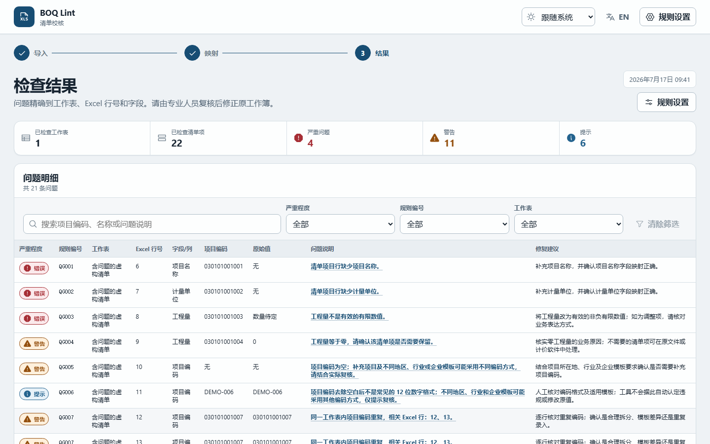

# BOQ Lint / 清单校核

[简体中文](README.md)

BOQ Lint is a local-first Excel risk checker for Bill of Quantities. It helps Quantity Surveying, Construction Cost, Cost Estimation, and Tendering teams detect data-quality and consistency risks before a workbook is imported, reviewed, or delivered.

The selected workbook is processed entirely in the browser. There is no backend, upload API, database, account, telemetry, advertising, AI, LLM, or API key.



See also: [issue results](docs/assets/issues.png), [rule catalog](docs/rule-catalog.md), [domain assumptions](docs/domain-assumptions.md), and [privacy](docs/privacy.md).

## What it solves

- inconsistent worksheet layouts, header rows, and field aliases;
- missing item code, name, feature, unit, quantity, unit price, or total price;
- invalid numeric values and inconsistent amount calculations;
- duplicate codes and possible duplicate BOQ items;
- short or placeholder item-feature descriptions;
- formula cells without readable cached results;
- hidden rows, hidden columns, and merged-cell structure risks;
- inconsistent manual issue lists that are difficult to hand back to preparers.

## Three-step workflow

1. Import one `.xlsx` file up to 20 MB, or load the fictional built-in issue sample.
2. Confirm worksheets, detected header rows, and field mappings; adjust them when needed.
3. Run checks, filter and locate issues, then export XLSX, CSV, or JSON reports.

## Supported files

| Format                        | v0.1.0                                   |
| ----------------------------- | ---------------------------------------- |
| `.xlsx`                       | Supported; processed locally             |
| `.xls`                        | Not supported                            |
| `.xlsm`                       | Not supported; macros are never executed |
| PDF                           | Not supported                            |
| Encrypted or corrupt workbook | Rejected with a clear error              |

Refreshing or closing the page does not restore imported workbook content, file names, mappings, or results.

## Auxiliary rule overview

| Rule    | Severity | Check                                                |
| ------- | -------- | ---------------------------------------------------- |
| `QG001` | error    | Missing item name                                    |
| `QG002` | error    | Missing unit                                         |
| `QG003` | error    | Invalid or negative quantity                         |
| `QG004` | warning  | Zero quantity                                        |
| `QG005` | warning  | Missing item code                                    |
| `QG006` | info     | Uncommon item-code format                            |
| `QG007` | warning  | Duplicate non-empty code within one worksheet        |
| `QG008` | warning  | Possible duplicate item fingerprint                  |
| `QG009` | warning  | Missing, short, or placeholder item feature          |
| `QG010` | error    | Quantity × unit price does not match total price     |
| `QG011` | warning  | Zero or negative unit price                          |
| `QG012` | info     | Large unit-price deviation within a comparable group |
| `QG013` | warning  | Formula without a readable cached result             |
| `QG014` | info     | Hidden row/column or merged-cell structure risk      |

`QG010` uses `decimal.js` and the default tolerance `max(CNY 0.01, |total price| × 0.1%)`. See [docs/rule-catalog.md](docs/rule-catalog.md) for the exact scope and remediation.

## Product boundaries

- A BOQ workbook alone cannot prove whether drawings contain genuinely omitted work.
- Item-code conventions vary by region, industry, and organization.
- Zero or negative unit prices may have valid commercial meanings.
- Price dispersion is a review signal, not an automatic pricing verdict.
- BOQ Lint does not bundle standards text, rate databases, price databases, or commercial software samples.
- BOQ Lint does not claim full conformity with GB/T 50500-2024 and does not replace professional review.

> BOQ Lint is an auxiliary Excel data-quality checker. It is not a construction-cost audit conclusion and cannot replace drawings, contracts, measurement rules, or qualified professional review.

## Local development

Requirements:

- Node.js 22
- pnpm 10.13.1

```bash
corepack enable
corepack prepare pnpm@10.13.1 --activate
pnpm install --frozen-lockfile
pnpm generate:samples
pnpm dev
```

Quality commands:

```bash
pnpm lint
pnpm format
pnpm format:check
pnpm typecheck
pnpm test
pnpm test:coverage
pnpm build
pnpm exec playwright install chromium
pnpm test:e2e
pnpm check
```

`pnpm check` runs lint, format check, typecheck, unit tests, and build in that order.

## GitHub Pages

Vite uses `base: './'`, so built assets use relative paths and work under a repository subdirectory. The Pages workflow uses Node.js 22, pnpm frozen installation, `actions/configure-pages`, `actions/upload-pages-artifact`, and `actions/deploy-pages`. It deploys the `dist/` artifact without committing build output or using a backend.

Set the repository's Pages source to **GitHub Actions**.

## Contributing and roadmap

Read [CONTRIBUTING.md](CONTRIBUTING.md), [CODE_OF_CONDUCT.md](CODE_OF_CONDUCT.md), and [SECURITY.md](SECURITY.md). Use only entirely fictional workbooks in public issues and pull requests.

The v0.2.0–v0.5.0 plan, suggested repository topics, and good-first-issue ideas are in [docs/roadmap.md](docs/roadmap.md).

## License

[MIT](LICENSE) © BOQ Lint contributors
