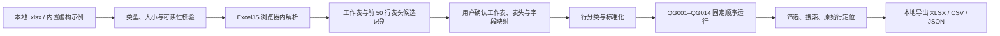

# BOQ Lint 架构

BOQ Lint（清单校核）v0.1.0 是纯静态、浏览器本地运行的 React + TypeScript 应用。部署端只提供 HTML、JavaScript、CSS 和完全虚构的示例文件；用户选择的工程量清单不会发送到服务器或第三方服务。

## 设计目标

- `.xlsx` 解析、字段映射、检查和报告导出全部在浏览器完成；
- 解析、行分类、规则判断和 React 组件职责分离；
- 严格 TypeScript，金额运算使用 `decimal.js`；
- 模板识别可解释、可人工覆盖；
- 所有问题可追溯到工作表、Excel 行号、字段和原值；
- 输入工作簿始终只读，报告作为新文件生成；
- Vite 使用相对资源路径，可部署到 GitHub Pages 仓库子目录。

## 数据流

不存在从工作簿解析、映射或规则检查到网络服务、数据库或遥测系统的数据路径。

## 职责划分

### 应用与组件

`src/App.tsx` 负责三步流程编排、内存状态和核心 API 调用；`src/ui/` 负责导入、映射、结果、规则设置及其可访问交互。工作簿内容以纯文本渲染，不使用 `dangerouslySetInnerHTML`。

### 核心领域与 Excel 层

`src/core/` 是与 React 解耦的核心层，按文件进一步分责：

- `workbook.ts`：ExcelJS 解析、输入限制、工作表与单元格快照；
- `fields.ts`：前 50 行表头检测、字段别名评分与映射；
- `numbers.ts`：本地化数值清洗和 Decimal 金额运算；
- `rows.ts`：清单项目、章节、合计、备注、空白和重复表头分类，并保存判定原因；
- `rule-definitions.ts`、`rules.ts`：QG001–QG014 元数据、固定顺序、开关、参数、去重与跨行索引；
- `config.ts`：规则和阈值配置校验、导入导出及非工程偏好持久化；
- `exports.ts`：XLSX、CSV 和 JSON 报告生成。

CSV 文本必须中和 `=`、`+`、`-`、`@` 公式前缀。金额比较不得直接依赖 JavaScript 二进制浮点数。

## 状态与持久化

原始文件字节、工作簿对象、工作表快照、字段映射和检查结果只保存在当前页面内存中。刷新、关闭页面或清空当前文件后不恢复工程数据。

如需保存非工程偏好，只能保存语言、主题、规则开关和阈值；不得保存工作簿内容、文件名、映射或检查结果。

## 构建与部署

- Node.js 22；
- pnpm 10.13.1；
- `pnpm install --frozen-lockfile`；
- `pnpm check` 按 lint、format check、typecheck、unit test、build 的顺序执行；
- Vite `base: './'`；
- GitHub Pages 通过官方 artifact 工作流部署 `dist/`；
- 工作流不得提交构建产物或向 `main` 推送机器人提交。

## 测试策略

- **Vitest**：表头识别、别名映射、行分类、数值清洗、QG001–QG014、Decimal 误差、跨工作表隔离、规则开关和 CSV 注入防护；
- **Testing Library**：关键状态、键盘交互、ARIA、映射和筛选；
- **Playwright**：问题示例、手动映射、检查结果、筛选、搜索、三种导出、清空重置和干净示例；
- **隐私检查**：导入和检查工程文件期间不得产生上传请求；
- **截图检查**：`docs/assets/overview.png` 与 `docs/assets/issues.png` 必须来自真实运行页面。

## 信任边界

文件名、工作表名、单元格内容、公式、缓存结果和导入配置均视为不可信输入。应用不执行宏或公式，不跟随工作簿外部链接，不记录工程内容，不内置受限制的标准、定额或价格数据。

领域边界详见 [domain-assumptions.md](domain-assumptions.md)，规则契约详见 [rule-catalog.md](rule-catalog.md)，隐私边界详见 [privacy.md](privacy.md)。
